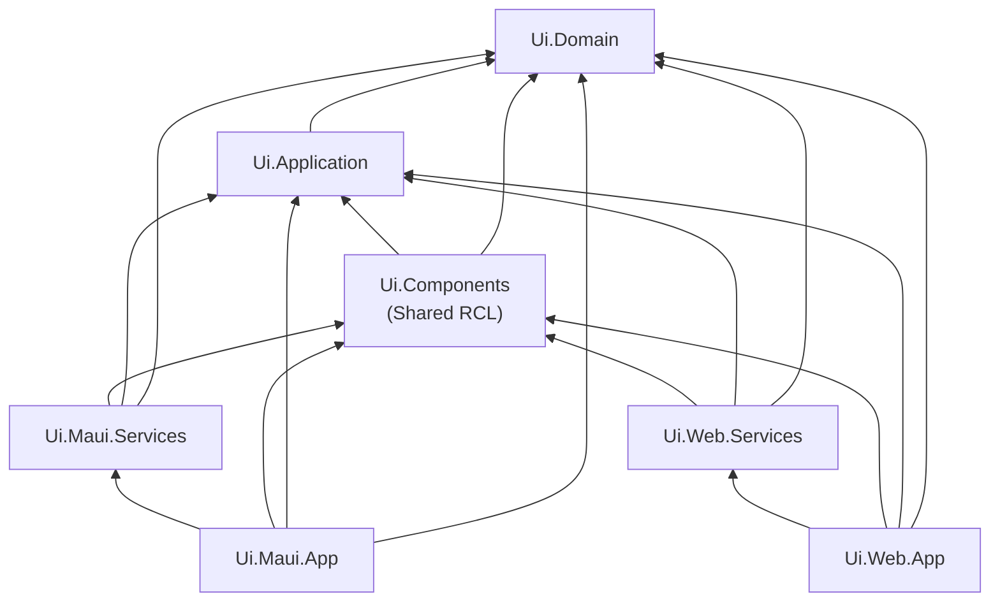

# Project structure and dependencies

Use this solution layout and dependency flow as the default for a MAUI + Blazor shared-UI app:

## Projects and responsibilities

- **Ui.Domain**
UI domain models, value objects, enums, domain rules, pure domain logic.
Must not depend on MAUI, ASP.NET Core hosting, or Blazor hosting.
- **Ui.Application**
Application services, orchestration, validation, state coordination, shared UI business workflows.
May depend on `Ui.Domain` only.
- **Ui.Components**
Shared Razor Class Library (RCL): pages, components, layouts, static assets, and interfaces needed by shared UI.
May depend on `Ui.Application` and `Ui.Domain`.
Must not depend on `Ui.Maui.Services`, `Ui.Web.Services`, `Ui.Maui.App`, or `Ui.Web.App`.
- **Ui.Maui.Services**
MAUI-specific implementations of shared interfaces (device info, permissions, file access, connectivity, secure storage, etc.).
May depend on `Ui.Components`, `Ui.Application`, `Ui.Domain`, and MAUI APIs.
- **Ui.Maui.App**
MAUI host: `MauiProgram`, `MainPage`, `BlazorWebView` hosting, DI registration, app shell, lifecycle.
May depend on `Ui.Maui.Services`, `Ui.Components`, `Ui.Application`, and `Ui.Domain`.
- **Ui.Web.Services**
Web-specific implementations of shared interfaces (auth/session integration, browser/server APIs, JS interop wrappers, etc.).
May depend on `Ui.Components`, `Ui.Application`, and `Ui.Domain`.
- **Ui.Web.App**
Blazor Web App host: ASP.NET Core startup, render-mode configuration, routing host, DI registration.
May depend on `Ui.Web.Services`, `Ui.Components`, `Ui.Application`, and `Ui.Domain`.

### Dependency Diagram



# Shared UI rules
`Ui.Components` is the shared Razor Class Library (RCL) and must remain **host-agnostic**. Its purpose is to contain reusable UI that can run in both `Ui.Maui.App` and `Ui.Web.App` without modification. Shared components must avoid direct dependencies on MAUI APIs, ASP.NET Core host infrastructure, or assumptions about whether they run in Blazor Server, WebAssembly, Hybrid, or static SSR.

## What may live in `Ui.Components`
- Shared Razor pages and routable views intended to run in both MAUI and web.
- Reusable Razor components, layouts, templates, dialogs, form components, grids, and shared UI building blocks.
- Component-local state and presentation logic.
- Shared CSS, images, icons, static web assets, and component-specific JavaScript interop wrappers that are host-neutral.
- View models, UI DTOs, mapping helpers, validation helpers, and display-oriented enums/constants.
- Interfaces and abstractions required by shared UI, such as file pickers, permissions, device info, connectivity, auth context, or storage access. These interfaces must be implemented in host-specific service projects.


## What must not live in `Ui.Components`
- Direct MAUI API calls such as `DeviceInfo`, `Permissions`, `FileSystem`, `Connectivity`, `Geolocation`, `SecureStorage`, or platform lifecycle APIs.
- Web host startup code, ASP.NET Core middleware, endpoint configuration, authentication middleware, or server-only pipeline logic.
- Host-specific service implementations.
- Environment-specific assumptions such as “this always runs in a browser,” “this always has SignalR,” or “this always has direct file-system access.”
- Business logic that belongs in `Ui.Domain` or orchestration/use-case logic that belongs in `Ui.Application`.


## Render-mode rules for shared components
Shared components should be **render-mode agnostic by default**. In most cases, reusable component authors should not specify `@rendermode` inside components in the RCL because the component author should not decide whether the host uses `InteractiveServer`, `InteractiveWebAssembly`, `InteractiveAuto`, Hybrid, or static SSR. Microsoft explicitly recommends that component authors avoid coupling components to a specific render mode or hosting model.

Rules:
- Do not place `@rendermode` in shared components unless there is a documented, explicit reason.
- Prefer having the host app or top-level wrapper choose the render mode.
- Shared components must degrade gracefully when rendered statically.
- Shared components must not assume they are interactive during initial render.
- If a routable shared page needs special render-mode handling for the web app, prefer a host-side wrapper or host-configured global interactivity over embedding render-mode decisions in the shared page itself.


## Dependency rules for shared UI
- `Ui.Components` may depend on `Ui.Application` and `Ui.Domain`.
- `Ui.Components` may define interfaces that are implemented by `Ui.Maui.Services` and `Ui.Web.Services`.
- `Ui.Components` must never reference `Ui.Maui.Services`, `Ui.Web.Services`, `Ui.Maui.App`, or `Ui.Web.App`.


## Design rules for shared components
- Components must accept data and behavior through parameters, cascading parameters, and injected abstractions.
- Components must prefer interface-based services over concrete host-specific implementations.
- Components must keep UI concerns local and delegate workflows and orchestration to `Ui.Application`.
- Components should be reusable, composable, and testable in isolation.
- Components intended for UI automation should expose stable selectors such as consistent element IDs, attributes, or testing hooks, and MAUI-hosted interactive elements should also be designed with automation support in mind.


## Practical rule of thumb
If code in `Ui.Components` would fail to compile without MAUI packages, browser-only assumptions, or web host startup features, it is in the wrong project. If a shared component needs host-specific behavior, define an interface in `Ui.Components` or `Ui.Application` and implement it in `Ui.Maui.Services` and `Ui.Web.Services` instead.

## Preferred pattern
Use this pattern whenever a shared component needs platform-specific behavior:
1. Define an interface in `Ui.Components` or `Ui.Application`.
2. Inject that interface into the shared component.
3. Implement the interface in `Ui.Maui.Services` and `Ui.Web.Services`.
4. Register the appropriate implementation in the host app’s DI container.

## Anti-patterns
- Calling MAUI Essentials APIs directly from a shared Razor component.
- Using `@rendermode InteractiveServer` or `@rendermode InteractiveWebAssembly` directly in reusable shared components without a documented exception.
- Putting web authentication middleware knowledge or MAUI app lifecycle behavior inside shared UI.
- Embedding platform detection and branching logic directly in components when an interface-based service would isolate the difference more cleanly.

# Host-specific rules
**Core idea:** Shared layers (`Ui.Domain`, `Ui.Application`, `Ui.Components`) define *what* is needed; host layers (`Ui.Maui.Services`, `Ui.Maui.App`, `Ui.Web.Services`, `Ui.Web.App`) define *how* it’s done on each platform.

## General rule
If code touches **device, OS, browser, or host startup/rendering**, it is host-specific and must not live in shared libraries.

## What must stay in MAUI
Lives in `Ui.Maui.Services` / `Ui.Maui.App`:
- Device info, platform/app metadata.
- Permissions checks and permission requests.
- File system access, file pickers, cache/data folders, secure storage.
- Connectivity, sensors, camera, geolocation, notifications, clipboard, share sheet, launcher, deep links.
- `BlazorWebView` setup, MAUI shell, lifecycle and windowing.

Rule of thumb: if it uses MAUI namespaces or platform APIs, it belongs here.

## What must stay in Web
Lives in `Ui.Web.Services` / `Ui.Web.App`:
- Browser APIs and JS interop wrappers.
- ASP.NET Core startup, middleware, endpoints, auth/cookie/session integration.
- Web render-mode configuration and global interactivity.
- Web-specific storage and networking behavior.

Rule of thumb: if it depends on ASP.NET Core host, `HttpContext`, or browser-only APIs, it belongs here.

## Shared abstraction pattern
For any platform-dependent capability:
1. Define an interface in a shared layer (`Ui.Components` or `Ui.Application`).
2. Inject that interface into shared components/services.
3. Implement it in `Ui.Maui.Services` and/or `Ui.Web.Services`.
4. Register concrete implementations in `Ui.Maui.App` and `Ui.Web.App`.

## Must NOT happen
- No MAUI APIs or browser/host APIs called directly from `Ui.Components`, `Ui.Application`, or `Ui.Domain`.
- No host startup or render-mode configuration in shared libraries.
- No branching on “am I MAUI or Web?” in shared code; use interfaces instead.
# State and data rules
Application logic must be separated from rendering and hosting so shared behavior can be reused in both MAUI and web without pulling UI or platform concerns into the wrong layer. Shared state, models, validation, and services are easier to test and evolve when they are host-agnostic and do not depend on rendering infrastructure.

## State ownership
Component-local state should stay inside the component when it is purely presentational and not shared outside that view. State that must be shared across multiple views or coordinated across workflows should move into dedicated services in `Ui.Application` rather than being duplicated inside components.

## Model placement
Domain entities, value objects, and business rules belong in `Ui.Domain`. Application-facing models, orchestration services, validation flows, and shared UI workflow state belong in `Ui.Application`. UI-only display models and view shaping helpers may live in `Ui.Components` when they are presentation-specific and host-agnostic.

## Validation rules
Validation logic that expresses business rules or workflow rules should live outside components so it can be reused and tested independently of the UI. Components may handle immediate presentation concerns such as showing messages, field formatting, and visual validation states, but the validation logic itself should live in shared services or models when it is reused across screens.

## Service rules
Shared services should be defined in `Ui.Application` when they coordinate workflows, load data, manage shared state, or expose reusable business behavior. These services must remain host-agnostic and must not depend on MAUI APIs, ASP.NET Core host types, or browser-specific APIs.

## Persistence and host boundaries
If state persistence depends on a host capability such as browser storage, secure storage, local files, or server-specific persistence, the persistence mechanism must be hidden behind an interface and implemented in the appropriate host-specific layer. Shared layers may define what needs to be stored, but they must not directly depend on where or how the state is persisted.

## Practical rules
Prefer component parameters and local fields for isolated UI state, use shared application services for cross-component state, and avoid unnecessary global state containers unless the application truly needs them. Keep models and validation reusable, keep services host-agnostic, and keep rendering concerns out of `Ui.Domain` and `Ui.Application`.

# UI and testing rules
UI code must be written so that both web and MAUI hosts can be tested reliably. Shared testability depends on stable identifiers, predictable component behavior, and a clear separation between UI logic and host-specific automation setup.

## AutomationId rule
All MAUI UI elements that need to be exercised by automated tests must set a unique `AutomationId`. Microsoft identifies `AutomationId` as the most reliable and performant way to locate .NET MAUI elements across supported platforms.

## Stable selectors
Do not rely on visible text, layout position, or fragile styling-based selectors when a stable identifier can be used instead. Interactive elements that represent important workflows should expose stable automation hooks consistently so tests remain reliable as UI text or layout changes.

## Testing tools
MAUI UI automation should use Appium with a .NET test framework such as NUnit, xUnit, or MSTest. The web app should use Playwright for browser-based end-to-end testing, while shared logic below the UI should be covered with unit and integration tests outside the UI automation layer.

## Shared test patterns
Tests should use shared patterns such as page objects, helper methods, and common scenario naming so equivalent user flows can be validated across MAUI and web even though the automation tools differ. This keeps the test suites aligned around business behavior instead of binding them too tightly to platform-specific mechanics.

## Testable UI design
UI components should expose clear interaction points, stable loading states, and deterministic outcomes so automated tests can interact with them without timing hacks or brittle assumptions. If a screen or component is difficult to automate, that should be treated as a design smell and refactored toward clearer states and more stable selectors.

## Practical rules
Set `AutomationId` on every MAUI element that a test must find, click, type into, or assert against. Prefer Appium for MAUI, Playwright for web, and shared test structure for common workflows.

# Reactive cross-platform layout guidelines
Build the app as **one shared application model with adaptive presentation**, not as separate web, mobile, and tablet implementations. Shared state, workflows, validation, and business logic should live in `Ui.Application` and `Ui.Domain`, while `Ui.Components` contains host-agnostic Razor UI that adapts to form factor through responsive and adaptive techniques such as CSS Grid, Flexbox, media queries, and runtime layout switching.[^1][^2]

Keep the **workflow and state the same**, but allow the **layout shell, density, and navigation pattern** to change by viewing state. For example, phone layouts may use stacked content and bottom navigation, tablet layouts may use split views, and desktop/web layouts may use side navigation and denser panels; these differences should be handled through adaptive shared components or host shells, not by duplicating business logic.[^3][^1]

## Viewing state rules
Determine viewing state from **viewport size first**, then refine with **host and orientation** only when needed. Microsoft’s responsive Blazor guidance highlights media queries and runtime adaptation as the core mechanism for adjusting layout and behavior based on screen size.[^4][^1]

Use a small shared abstraction such as `IViewStateService` or `IViewportService` that exposes a normalized state, for example:

- `Phone`
- `Tablet`
- `Desktop`

This service should be updated from host-specific viewport or window-size signals and consumed by shared components for layout decisions. The state should describe **layout intent**, not device branding, because a tablet-sized browser window on desktop may need the same layout as a tablet device.[^1][^4]

## Implementation details
Prefer these rules for identifying viewing state:

- **Phone**: narrow width, compact navigation, stacked panels, reduced density.
- **Tablet**: medium width, split layouts, dual-pane where useful, moderate density.
- **Desktop**: wide width, sidebars, multi-column layouts, full-density views.[^1]

A practical implementation is to centralize breakpoints in one shared place, for example:

```csharp
public enum ViewState
{
    Phone,
    Tablet,
    Desktop
}

public static class ViewBreakpoints
{
    public const int PhoneMax = 767;
    public const int TabletMax = 1023;
}
```

Then map width to state:
```csharp
public static ViewState GetViewState(double width) =>
    width <= ViewBreakpoints.PhoneMax ? ViewState.Phone :
    width <= ViewBreakpoints.TabletMax ? ViewState.Tablet :
    ViewState.Desktop;
```

The important rule is that all components use the **same breakpoint source**, so the app does not make inconsistent layout decisions across pages. Runtime viewport detection can come from browser media queries or equivalent host window-size events, then be surfaced through a shared service.[^4][^1]

## Decision rules
Use **CSS-only responsiveness** when the same component structure works and only spacing, grid columns, or visibility need to change. Use **runtime view-state switching** when the app must change component composition, navigation pattern, amount of data shown, or which template gets rendered. Microsoft’s responsive guidance explicitly distinguishes CSS adaptation from runtime adaptive behavior for maximum control.[^4][^1]

Do not infer viewing state from “mobile OS vs desktop OS” alone. The primary decision should be **available width and layout constraints**, because desktop apps can be snapped narrow and tablets can run wide. Host type and orientation should only refine behavior after width-based classification.[^5][^4]

## Practical rules
- Keep shared state and workflows independent of layout.
- Base viewing state on centralized breakpoints, not ad hoc per-page checks.
- Prefer width-based layout classification over device-type detection.
- Use CSS for simple responsiveness; use runtime state for structural layout changes.
- Keep host-specific detection logic in MAUI/web services, but expose a shared normalized `ViewState` to components.[^2][^1]